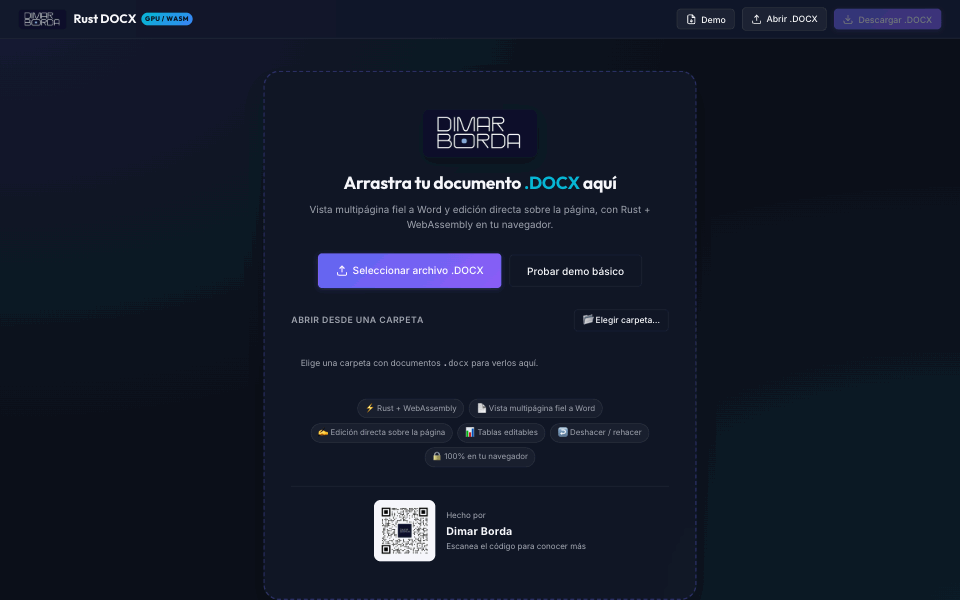

# Rust DOCX

**Editor de documentos Word (`.docx`) que corre 100% en el navegador, escrito en Rust y compilado a WebAssembly.**

Abre un `.docx`, edítalo directamente sobre la página, rellena variables de plantilla `{{...}}` y descárgalo de nuevo. Ningún archivo sale de tu equipo: no hay servidor.

[](https://www.npmjs.com/package/@dimarborda/docx-editor)
[](LICENSE)

### ▶ [Probar la demo](https://rust-web-docx.dimarborda.workers.dev/?demo) · 📦 [`npm install @dimarborda/docx-editor`](https://www.npmjs.com/package/@dimarborda/docx-editor)

<p align="center">
  
</p>

> Pensado para editar documentos y plantillas con alta fidelidad a Word, sin salir del navegador. Revisa las [limitaciones conocidas](#limitaciones-conocidas) antes de integrarlo.

---

## Qué hace

- **Edición directa sobre la página.** Cursor propio dibujado en canvas, selección con ratón y teclado entre párrafos, `Enter` para dividir y `Backspace` para unir párrafos, edición dentro de celdas de tabla, deshacer y rehacer.
- **Ediciones sin pérdidas.** Solo se reescriben los fragmentos XML que cambiaste; estilos, temas, relaciones, imágenes y secciones del archivo original quedan intactos.
- **Variables de plantilla.** Detecta `{{CAMPO}}` aunque Word lo haya partido en varios fragmentos (`<w:r>`) y lo reemplaza respetando el formato.
- **Maquetación parecida a Word.** Cascada de estilos `docDefaults → styles.xml → numbering.xml → formato directo`, medición real de fuentes, paginación, sangrías, interlineado, listas numeradas y tablas con bordes resueltos por lado. Las imágenes en línea fluyen con el texto y el texto rodea a las flotantes (cuadrado, estrecho, arriba y abajo, detrás o delante).
- **Cuadros de texto y formas.** Se dibujan los cuadros de texto de Word, tanto los actuales (DrawingML) como los de documentos antiguos (VML), con su relleno, su borde, sus márgenes internos y su alineación vertical, además de rectángulos, rectángulos redondeados y elipses. El texto los rodea igual que a las imágenes, y el texto de los cuadros actuales se edita haciendo clic dentro (un clic en el borde selecciona el cuadro para moverlo).
- **Encabezados y pies de página.** Se dibujan con su texto, tablas, imágenes y cuadros, con el número de página real en cada hoja (`PAGE`, `NUMPAGES`) y con primera página distinta. Si no caben en el margen, el cuerpo se desplaza como en Word. Un doble clic sobre ellos permite editar su texto (Esc vuelve al cuerpo).
- **Ajuste de texto como en Word.** El texto rodea los objetos flotantes por ambos lados cuando hay espacio, sigue su contorno en el ajuste estrecho, las tablas los esquivan y los objetos que se pisan respetan el orden de Word. La fila de encabezado de las tablas se repite en cada página.
- **Celdas combinadas.** Celdas que ocupan varias columnas (`gridSpan`) o varias filas (`vMerge`), dibujadas como una sola y sin partirse entre páginas cuando caben.
- **Imágenes editables.** Se seleccionan con un clic, se redimensionan con las asas, las flotantes se arrastran y cambian de ajuste, y todo está disponible desde código (`resizeImage`, `moveImage`, `setImageWrap`, `updateImage`).
- **Valores por defecto de Word.** Lo que el documento no especifica se dibuja como lo haría Word (Times New Roman 10 pt, sin bordes inventados), en lugar de "mejorarlo".
- **Buscar y reemplazar** con mayúsculas/minúsculas y expresiones regulares.
- **Exportar a PDF** vectorial, con texto seleccionable y las fuentes incrustadas, tal como se ve en el editor.
- **Privado por diseño.** Lectura del ZIP, análisis XML, maquetación, edición y reempaquetado ocurren en la memoria del navegador.

## Cómo funciona

```text
.docx ──► Rust/WASM: zip + quick-xml ──► modelo de documento ──► motor de maquetación ──► comandos de dibujo ──► Canvas 2D
              ▲                                                                                                  │
              └───────────── ediciones sin pérdidas del XML ◄── cursor, selección y teclado (JS) ◄────────────────┘
```

| Módulo | Responsabilidad |
| :--- | :--- |
| [`src/lib.rs`](src/lib.rs) | API WebAssembly (`DocxSession`) |
| [`src/docx_parser.rs`](src/docx_parser.rs) | Lectura del ZIP y del OpenXML, historial de cambios, cachés |
| [`src/styles.rs`](src/styles.rs) | Cascada de estilos, numeración y bordes de tabla |
| [`src/layout_engine.rs`](src/layout_engine.rs) | Corte de líneas, paginación, tablas e imágenes |
| [`src/caret.rs`](src/caret.rs) | Hit-testing, posición del cursor y rectángulos de selección |
| [`src/paragraph_edit.rs`](src/paragraph_edit.rs) | Ediciones de texto, división y unión de párrafos sin pérdidas |
| [`src/insert_objects.rs`](src/insert_objects.rs) | Tablas e imágenes insertadas desde código |
| [`src/image_edit.rs`](src/image_edit.rs) | Tamaño, posición, ajuste del texto y borrado de imágenes |
| [`src/shapes.rs`](src/shapes.rs) | Cuadros de texto y formas (DrawingML y VML): relleno, borde, márgenes internos y texto |
| [`src/sample_generator.rs`](src/sample_generator.rs) | Documento de demostración generado en memoria |
| [`packages/docx-editor/`](packages/docx-editor) | Paquete npm reutilizable: `DocxEditor`, `<docx-editor>` y barra de herramientas opcional |
| [`apps/demo/`](apps/demo) | La demo publicada, construida sobre el paquete |

Solo se vuelven a maquetar y dibujar las páginas que cambian, y las medidas de texto se guardan en caché, así que escribir sigue siendo fluido en documentos largos.

## Usarlo en tus proyectos

El editor está publicado en npm como [`@dimarborda/docx-editor`](https://www.npmjs.com/package/@dimarborda/docx-editor): un web component que funciona en cualquier frontend y dentro de apps Tauri.

```bash
npm install @dimarborda/docx-editor
```

```html
<docx-toolbar for="doc"></docx-toolbar>
<docx-editor id="doc" src="/plantilla.docx" style="height: 80vh"></docx-editor>
<script type="module">
  import '@dimarborda/docx-editor';
  import '@dimarborda/docx-editor/style.css';
</script>
```

La API completa, los ejemplos con React, Next.js y Tauri y las opciones de fuentes están en el [README del paquete](packages/docx-editor/README.md). Si tu sitio usa una cabecera `Content-Security-Policy`, añade `'wasm-unsafe-eval'` al `script-src` de producción; los detalles están en la sección [Content Security Policy](packages/docx-editor/README.md#content-security-policy). Un ejemplo mínimo de integración está en [`apps/demo/embed.html`](apps/demo/embed.html).

## Seguridad y privacidad

Todo ocurre en el navegador: los documentos no se envían a ningún servidor, no hay telemetría y el contenido se dibuja en un canvas, sin insertar HTML. El editor no resuelve entidades XML externas, pone límites a lo que un `.docx` puede ocupar al descomprimirse, y cada despliegue audita las dependencias de Rust y npm. Los detalles están en la sección [Seguridad y privacidad](packages/docx-editor/README.md#seguridad-y-privacidad) del paquete. Para reportar una vulnerabilidad, consulta [SECURITY.md](SECURITY.md).

## Limitaciones conocidas

Todavía no se soportan, o solo en parte:

- Formas agrupadas, lienzos de dibujo, ecuaciones y tablas dentro de cuadros de texto.
- Secciones con encabezados distintos (se usan los de la última sección) y encabezados de páginas pares.
- Comentarios, control de cambios y notas al pie (se conservan en el archivo, pero no se dibujan).
- Varias columnas por sección.

Si un documento tuyo se ve distinto que en Word, abre un *issue* con una captura (sin datos personales).

## Desarrollo local

Requisitos: Rust con el target `wasm32-unknown-unknown`, [`wasm-pack`](https://rustwasm.github.io/wasm-pack/) y Node.js 20 o superior.

```bash
git clone https://github.com/dimarborda/rust-web-docx.git
cd rust-web-docx
npm install
npm run build:wasm
npm run dev
```

Abre `http://localhost:5173`. Si cambias código en `src/`, vuelve a ejecutar `npm run build:wasm`.

- **Pruebas:** `cargo test`
- **Compilación de producción:** `npm run build` (sale en `apps/demo/dist/`)
- **Ejemplo de integración:** `http://localhost:5173/embed.html`
- **Documentos propios:** copia tus `.docx` en [`examples/`](examples) y aparecerán en la pantalla de inicio. Esa carpeta está ignorada por git, para que tus documentos nunca terminen en el repositorio.

## Despliegue

El sitio es estático y se publica en Cloudflare Workers. Cada push a `master` ejecuta las pruebas, compila y despliega con [GitHub Actions](.github/workflows/deploy.yml). Para desplegar a mano:

```bash
npm run deploy
```

## Atajos de teclado

| Atajo | Acción |
| :--- | :--- |
| Clic / arrastrar | Colocar el cursor / seleccionar |
| `Shift` + flechas | Ampliar la selección |
| `Inicio` / `Fin` | Ir al inicio o al final de la línea |
| `⌘A` / `Ctrl+A` | Seleccionar todo |
| `⌘Z` / `Ctrl+Z` | Deshacer |
| `⌘⇧Z` / `Ctrl+Y` | Rehacer |
| `⌘B` `⌘I` `⌘U` | Negrita, cursiva, subrayado |
| `⌘F` / `Ctrl+F` | Buscar y reemplazar |
| `⌘S` / `Ctrl+S` | Descargar el `.docx` |
| Clic en una imagen | Seleccionarla (asas para cambiar el tamaño; las esquinas mantienen la proporción, `Shift` la libera) |
| Arrastrar una imagen flotante | Moverla |
| Flechas / `Shift` + flechas | Mover la imagen flotante seleccionada 1 px / 10 px |
| `Supr` / `Retroceso` | Eliminar la imagen seleccionada |
| `Esc` | Volver al texto |

---

## English

**Rust DOCX** is a Word (`.docx`) editor that runs entirely in the browser: a Rust core compiled to WebAssembly parses the OpenXML, lays out pages the way Word does (style cascade, real font metrics, pagination, tables, inline pictures that flow with the text and floating ones that text wraps around) and renders them to a 2D canvas with its own caret and selection. Pictures can be selected, resized, moved and re-wrapped with the mouse or from code (`resizeImage`, `moveImage`, `setImageWrap`, `updateImage`). Edits are lossless: only the XML you touched is rewritten. Template placeholders like `{{FIELD}}` are replaced even when Word splits them across runs. No server is involved, so documents never leave your machine.

[Try the live demo](https://rust-web-docx.dimarborda.workers.dev/?demo), and see the [known limitations](#limitaciones-conocidas) above.

---

## Autor

<p align="center">
  
</p>

<p align="center">
  <strong>Desarrollado por Dimar Borda</strong>
</p>

## Licencia

[MIT](LICENSE)
